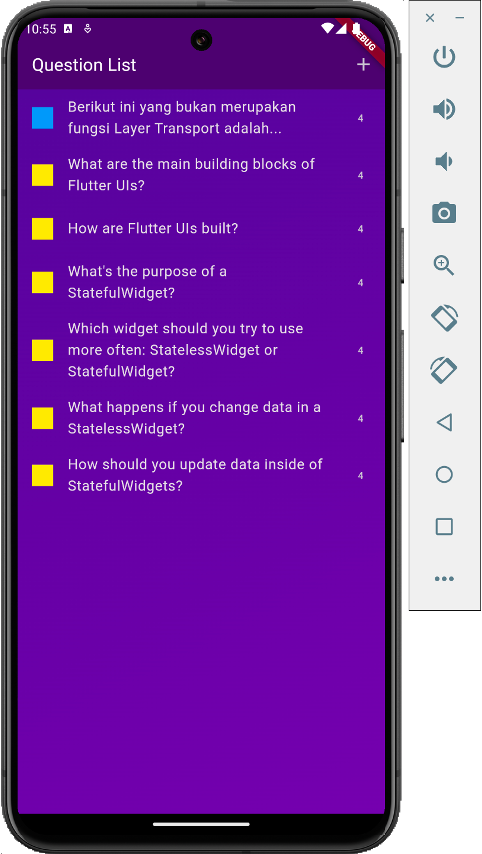

# Module 5: Handling Input User with Form

- [Module 5](#module-5)
  - [1. Preparation](#1-preparation)
    - [a. Restructure Project](#a-restructure-project)
    - [b. Run Project](#b-run-project)
  - [2. Create Data Model and Dummy Data](#2-create-data-model-and-dummy-data)
    - [a. Create `Category` Data Model](#a-create-category-data-model)
    - [b. Modify `Question` Data Model](#b-modify-question-data-model)
    - [c. Create `Category` Dummy Data](#c-create-category-dummy-data)
    - [d. Modify `Question` Dummy Data](#d-modify-question-dummy-data)
  - [3. Create Quiz Button](#3-create-quiz-button)
    - [a. Modify file `lib/components/quiz.dart`](#a-modify-file-libcomponentsquizdart)
    - [b. Imports](#b-imports)
    - [c. `Quiz` Widget](#c-quiz-widget)
    - [d. Add Method `createQuiz` in State Management](#d-add-method-createquiz-in-state-management)
    - [e. `build` Method](#e-build-method)
  - [4. Question List Screen UI](#4-question-list-screen-ui)
    - [a. Create file `lib/components/question_list_screen/question_list_screen.dart`](#a-create-file-libcomponentsquestion_list_screenquestion_list_screendart)
    - [b. Imports](#b-imports-1)
    - [c. `QuestionListScreen` Widget](#c-questionlistscreen-widget)
    - [d. State Management](#d-state-management)
    - [e. `build` Method](#e-build-method-1)
  - [5. New Question Form UI](#5-new-question-form-ui)
    - [a. Create file `lib/components/question_list_screen/new_question.dart`](#a-create-file-libcomponentsquestion_list_screennew_questiondart)
    - [b. Imports](#b-imports-2)
    - [c. `NewQuestion` Widget](#c-newquestion-widget)
    - [d. State Management](#d-state-management-1)
    - [e. `build` Method](#e-build-method-2)

## 1. Preparation 
### a. Restructure Project

```
lib/
├── components/
│   ├── question_list_screen/
│   │   ├── new_question.dart
│   │   └── question_list_screen.dart
│   ├── quiz.dart
│   ├── quiz_screen/
│   │   ├── answer_button.dart
│   │   └── question_screen.dart
│   ├── results_screen/
│   │   ├── question_identifier.dart
│   │   ├── questions_summary.dart
│   │   ├── results_screen.dart
│   │   └── summary_item.dart
│   └── start_screen/
│       └── start_screen.dart
├── data/
│   ├── categories.dart
│   └── questions.dart
├── main.dart
└── models/
    ├── category.dart
    └── question.dart
```

In this module, I restructured the code In the lib folder to make it easier to maintain.

1. **lib/**: The main directory for the Flutter project's Dart code
2. **components/**: UI components or widgets used throughout the application
3. **data/**: Data dummy files
4. **models/**: Data models used in the application
5. **quiz_screen/**: Components related to the quiz screen
6. **results_screen/**: Components related to the results screen
7. **start_screen/**: Components related to the start screen of the application
8. **main.dart**: The entry point for the application

### b. Run Project
1. Launch **Flutter Emulator** in the VS Code. Select **Pixel 8 API 33** (adjust to the android emulator you've created)
   

   
   
2. Run the project
    ```bash
    flutter run
    ```
    The output:
    ```bash
    Flutter run key commands.
    r Hot reload. 🔥🔥🔥
    R Hot restart.
    h List all available interactive commands.
    d Detach (terminate "flutter run" but leave application running).
    c Clear the screen
    q Quit (terminate the application on the device).
    ```
    To restart after making changes in the code:
    ```
    shift + R
    ```

## 2. Create Data Model and Dummy Data
### a. Create `Category` Data Model

**lib/models/category.dart**
```dart
import 'package:flutter/material.dart';

enum Categories { mobileProgramming, computerNetwork }

class Category {
  const Category(this.title, this.color);

  final String title;
  final Color color;
}
```

1. Import Statement
    ```dart
    import 'package:flutter/material.dart';
    ```
    * Imports the Flutter material design library
    * Provides access to a wide range of widgets and functionalities following material design guidelines

2. Enum Declaration
    ```dart
    enum Categories { mobileProgramming, computerNetwork }
    ```
    * Defines an enumeration named `Categories`
    * Contains two named constants:
      * `mobileProgramming`
      * `computerNetwork`
    * Useful for representing a fixed number of constant values
   
3. Class Declaration
    ```dart
    class Category {
      const Category(this.title, this.color);

      final String title;
      final Color color;
    }
    ```
    * Class Definition: Defines a class named `Category`
  
    * Constructor:
      ```dart 
      const Category(this.title, this.color);
      ```
        * Declares a `const` constructor
        * Takes two parameters: `title` and `color`
        * `const` indicates that instances of this class can be compile-time constants
  
    * Fields:
      ```dart
      final String title;
      final Color color;
      ```
        * `title`: A `String` representing the title of the category
        * `color`: A `Color` representing the color associated with the category
        * Both fields are `final`, meaning their values cannot be changed once they are set
  
This class can be used to create instances of categories with specific titles and colors. For example:

```dart
final Category category1 = Category('Mobile Programming', Colors.blue);
final Category category2 = Category('Computer Network', Colors.red);
```

These instances represent categories with the specified titles and colors.

### b. Modify `Question` Data Model

Modify existing `Question` data model

**lib/models/question.dart**
```dart
import 'package:adv_basic/models/category.dart';

class Question {
  const Question({required this.id, required this.text, required this.answers, required this.category});

  final String id;
  final String text;
  final List<String> answers;
  final Category category;

  List<String> getShuffledAnswers() {
    final shuffledList = List.of(answers);
    shuffledList.shuffle();
    return shuffledList;
  }
}
```

1. Import Statement

    ```dart
    import 'package:adv_basic/models/category.dart';
    ```
      * Imports the `category.dart` file from the `models` directory in the `adv_basic` package
      * Allows the use of the `Category` class defined in that file
   
2. Class Declaration
    ```dart
    class Question {
      const Question({required this.id, required this.text, required this.answers, required this.category});

      final String id;
      final String text;
      final List<String> answers;
      final Category category;

      List<String> getShuffledAnswers() {
        final shuffledList = List.of(answers);
        shuffledList.shuffle();
        return shuffledList;
      }
    }
    ```
    * Class Definition: Defines a class named `Question`
  
    * Constructor:

      ```dart
      const Question({required this.id, required this.text, required this.answers, required this.category});
      ```
      * Declares a `const` constructor
      * Uses named parameters with the `required` keyword, making all parameters mandatory
      * Parameters:
        * `id`: A `String` representing the unique identifier of the question
        * `text`: A `String` containing the text of the question
        * `answers`: A `List<String>` containing possible answers to the question
        * `category`: A `Category` object representing the category to which the question belongs
  
    * Fields:
      ```dart
      final String id;
      final String text;
      final List<String> answers;
      final Category category;
      ```
        * `id`: A unique identifier for the question
        * `text`: The text content of the question
        * `answers`: A list of possible answers to the question
        * `category`: The category of the question, represented by a Category object
        * All fields are `final`, meaning their values cannot be changed once they are set

    * Method:

      ```dart
      List<String> getShuffledAnswers() {
        final shuffledList = List.of(answers);
        shuffledList.shuffle();
        return shuffledList;
      }
      ```
      * `getShuffledAnswers`: A method that returns a shuffled list of answers
      * Creates a copy of the `answers` list and shuffles it
      * Returns the shuffled list
  
This class can be used to create instances of questions with specific attributes and provides a method to get the answers in a random order. For example:

```dart
final question = Question(
  id: 'q1',
  text: 'What is the capital of France?',
  answers: ['Paris', 'London', 'Berlin', 'Rome'],
  category: someCategoryInstance
);

final shuffledAnswers = question.getShuffledAnswers();
```

These instances represent questions with the specified attributes and can be used to randomly shuffle the answers.

### c. Create `Category` Dummy Data

**lib/data/categories.dart**
```dart
import 'package:adv_basic/models/category.dart';
import 'package:flutter/material.dart';

const categories = {
  Categories.mobileProgramming: Category("Mobile Programming", Colors.yellow),
  Categories.computerNetwork: Category("Computer Network", Colors.blue)
};
```

### d. Modify `Question` Dummy Data

Modify the structure of creating instances of questions.

**lib/data/questions.dart**
```dart
import 'package:adv_basic/data/categories.dart';
import 'package:adv_basic/models/category.dart';
import 'package:adv_basic/models/question.dart';

final questions = [
  Question(
      id: '1',
      text: 'Berikut ini yang bukan merupakan fungsi Layer Transport adalah...',
      answers: ['Routing', 'Segmentasi', 'Flow control', 'Error control'],
      category: categories[Categories.computerNetwork]!),
];
```

## 3. Create Quiz Button

<div style="text-align: center;">
  
</div>

### a. Modify file `lib/components/quiz.dart`

[lib/components/quiz.dart](../lib/components/quiz.dart)

The `Quiz` widget manages a multi-screen quiz application using stateful navigation. Users can start the quiz, answer questions, view results, or create new questions.

### b. Imports

```dart
import 'package:adv_basic/components/question_list_screen/question_list_screen.dart';
import 'package:adv_basic/components/quiz_screen/question_screen.dart';
import 'package:adv_basic/components/results_screen/results_screen.dart';
import 'package:adv_basic/components/start_screen/start_screen.dart';
import 'package:flutter/material.dart';
import 'package:adv_basic/data/questions.dart';
```
Don't forget to import `question_list_screen.dart`, which will be created in the next stage.

### c. `Quiz` Widget

* **Stateful Widget**: Stateful widget `Quiz` with a state managed by State class `_QuizState`.

  ```dart
  class Quiz extends StatefulWidget {
    const Quiz({super.key});

    @override
    State<Quiz> createState() {
      return _QuizState();
    }
  }

  class _QuizState extends State<Quiz> {
    ...
  }
  ```

### d. Add Method `createQuiz` in State Management

In the State class:

* Existing **state variables**:
  ```dart
  List<String> selectedAnswers = [];  
  var activeScreen = 'start-screen';
  ```

  * `selectedAnswers`: List to store chosen answers.

  * `activeScreen`: String to track the current active screen.

* Existing **state methods**:
  ```dart
  void switchScreen() {
    setState(() {
      activeScreen = 'question-screen';
    });
  }

  void chooseAnswer(String answer) {
    selectedAnswers.add(answer);

    if (selectedAnswers.length == questions.length) {
      setState(() {
        activeScreen = 'results-screen';
      });
    }
  }

  void restartQuiz() {
    setState(() {
      selectedAnswers = [];
      activeScreen = 'question-screen';
    });
  }
  ```
  * `switchScreen`: Switches to the question screen.
  * `chooseAnswer`: Adds an answer to selectedAnswers and navigates to the results screen if all questions are answered.
  * `restartQuiz`: Resets the quiz to the initial state.

* Add new **state method** to create quiz: 
  ```dart
  void createQuiz() {
    setState(() {
      activeScreen = 'question-list-screen';
    });
  }
  ```
### e. `build` Method

In the `build` method of State class:

```dart
@override
Widget build(context) {
  Widget screenWidget = StartScreen(switchScreen, createQuiz);

  if (activeScreen == 'question-screen') {
    screenWidget = QuestionScreen(
      onSelectAnswer: chooseAnswer,
    );
  }

  if (activeScreen == 'results-screen') {
    screenWidget =
        ResultsScreen(chosenAnswers: selectedAnswers, onRestart: restartQuiz);
  }

  if (activeScreen == 'question-list-screen') {
    screenWidget = const QuestionListScreen();
  }
  ...
}
```

Dynamically displays the appropriate screen based on `activeScreen`:

* `StartScreen` for the start view.
* `QuestionScreen` for answering questions.
* `ResultsScreen` for displaying results.
* `QuestionListScreen` for managing questions (add this)

## 4. Question List Screen UI

<div style="text-align: center;">
  
</div>

### a. Create file `lib/components/question_list_screen/question_list_screen.dart`

[lib/components/question_list_screen/question_list_screen.dart](../lib/components/question_list_screen/question_list_screen.dart)
   
This code defines a `QuestionListScreen` widget, which displays a list of questions that can be added or removed dynamically.

### b. Imports 
   
```dart
import 'package:adv_basic/components/question_list_screen/new_question.dart';
import 'package:adv_basic/data/questions.dart';
import 'package:adv_basic/models/question.dart';
import 'package:flutter/material.dart';
```
These imports bring in necessary Flutter widgets and custom components, models, and data.

### c. `QuestionListScreen` Widget
* **Stateful Widget**: `QuestionListScreen` is a stateful widget, meaning it can change over time.
   ```dart
   class QuestionListScreen extends StatefulWidget {
     const QuestionListScreen({super.key});

     @override
     State<QuestionListScreen> createState() => _QuestionListScreenState();
   }
   ```

* **State Class**: `_QuestionListScreenState` manages the state of QuestionListScreen.
   ```dart
   class _QuestionListScreenState extends State<QuestionListScreen> {
     ...
   }
   ```

### d. State Management

In the State class: 

* **List of Questions**: `_questions` holds the list of questions.

  ```dart
  final List<Question> _questions = [];
  ```

* **Add Question**: `_addQuestion` method navigates to a `NewQuestion` screen and adds the returned question to `_questions`.

  ```dart
  void _addQuestion() async {
    final newQuestion = await Navigator.of(context).push<Question>(
      MaterialPageRoute(
        builder: (ctx) => const NewQuestion(),
      ),
    );

    if (newQuestion == null) {
      return;
    }

    setState(() {
      _questions.add(newQuestion);
    });
  }
  ```

* **Remove Question**: `_removeQuestion` method removes a specified question from _questions.

  ```dart
  void _removeQuestion(Question question) {
  setState(() {
      _questions.remove(question);
    });
  }
  ```

### e. `build` Method

In the `build` method of State class: 

```dart
@override
Widget build(context) {
  ...
}
```

* **Content Display**:  If `_questions` is empty, a message "No questions added yet!" is shown. Otherwise, a list of questions is displayed using a `ListView.builder`.

  ```dart
  Widget content = const Center(
    child: Text('No questions added yet!'),
  );
  ```

* **Dismissible List**: Each question is wrapped in a `Dismissible` widget to enable swipe-to-delete functionality.

  ```dart
  if (_questions.isNotEmpty) {
    content = ListView.builder(
      itemCount: _questions.length,
      itemBuilder: (context, index) => Dismissible(
        onDismissed: (direction) {
          _removeQuestion(_questions[index]);
        },
        key: ValueKey(_questions[index].id),
        child: ListTile(
          title: Text(_questions[index].text),
          leading: Container(
            width: 24,
            height: 24,
            color: _questions[index].category.color,
          ),
          trailing: Text(_questions[index].answers.length.toString()),
        ),
      ),
    );
  }
  ``` 

* **Scaffold**: Provides the basic structure with an app bar and body.

  ```dart
  return Scaffold(
    ...
  )
  ```

* **AppBar**: Contains a `title` and an add `button`. The add button triggers `_addQuestion`.

  ```dart
  appBar: AppBar(
    title: const Text('Question List'),
    actions: [
      IconButton(
        onPressed: _addQuestion,
        icon: const Icon(Icons.add),
      )
    ],
  ),
  ```

* **Gradient Background**: The body has a `gradient background` and contains the dynamic content (content).

  ```dart
  body: Container(
    decoration: const BoxDecoration(
      gradient: LinearGradient(
        colors: [
          Color.fromARGB(255, 78, 13, 151),
          Color.fromARGB(255, 107, 15, 168)
        ],
        begin: Alignment.topLeft,
        end: Alignment.bottomRight,
      ),
    ),
    child: content,
  ),
  ```

## 5. New Question Form UI

<div style="text-align: center;">
  
</div

### a. Create file `lib/components/question_list_screen/new_question.dart`

[lib/components/question_list_screen/new_question.dart](../lib/components/question_list_screen/new_question.dart)

This code defines a stateful widget, `NewQuestion`, that provides a form for users to input a new question, its possible answers, and select a category. 

The form **validates the input** and, upon submission, sends the new question back to the previous screen.
   
### b. Imports

```dart
import 'package:adv_basic/data/categories.dart';
import 'package:adv_basic/models/category.dart';
import 'package:adv_basic/models/question.dart';
import 'package:flutter/material.dart';
```

These imports include necessary Flutter widgets and custom models and data for categories and questions.

### c. `NewQuestion` Widget

* **Stateful Widget**: `NewQuestion` is a Stateful widget with its state managed by a State class `_NewQuestionState`.

  ```dart
  class NewQuestion extends StatefulWidget {
    const NewQuestion({super.key});

    @override
    State<NewQuestion> createState() {
      return _NewQuestionState();
    }
  }

  class _NewQuestionState extends State<NewQuestion> {
    ...
  }
  ```

### d. State Management

In the State class:

* **Form Key**: `_formKey` is used to identify the form and manage its state. `GlobalKey<FormState>()` is a specialized type of `GlobalKey` that specifically identifies the FormState object associated with a Form widget. This allows you to perform operations on the FormState from outside the widget, such as validating the form, saving its state, or resetting it.

    ```dart
    final _formKey = GlobalKey<FormState>();
    ```

* **Entered Data**: `_enteredQuestion` and `_enteredAnswers` store the input from the user.

    ```dart
    var _enteredQuestion = '';
    var _enteredAnswers = '';
    ```

* **Selected Category**: `_selectedCategory` stores the chosen category from the dropdown menu, initialized with `Categories.mobileProgramming`.

    ```dart
    var _selectedCategory = Categories.mobileProgramming;
    ```

* `_saveItem`: Validates the form and saves the input. If valid, it creates a new `Question` object and returns it to the previous screen using `Navigator.pop`.

    ```dart
    void _saveItem() {
      if (_formKey.currentState!.validate()) {
        _formKey.currentState!.save();
        Navigator.of(context).pop(
          Question(
            id: DateTime.now().toString(),
            text: _enteredQuestion,
            answers: [_enteredAnswers],
            category: categories[_selectedCategory]!,
          ),
        );
      }
    }
    ```

### e. `build` Method

In the `build` method of State class:

```dart
@override
Widget build(BuildContext context) {
  ...
}
```

* `Scaffold`: Provides the basic structure with an app bar and body.

    ```dart
    return Scaffold(
      appBar: AppBar(
        title: const Text('Add a New Question'),
      ),
      body: Padding(
        padding: const EdgeInsets.all(12),
        child: Form(
          ...
        )
      )
    );
    ```

* `Form`: Contains text fields for the question and answers, a dropdown for category selection, and buttons to reset or save the form.

    ```dart
    Form(
      key: _formKey,
      child: Column(
        children: [
          ...
        ]
      )
    )
    ```

* `TextFormField`: Used for user input with validation logic.
  
    ```dart
    TextFormField(
      maxLength: 50,
      decoration: const InputDecoration(
        label: Text('Question'),
      ),
      validator: (value) {
        if (value == null ||
            value.isEmpty ||
            value.trim().length <= 1 ||
            value.trim().length > 50) {
          return 'Must be between 1 and 50 characters.';
        }
        return null;
      },
      onSaved: (value) {
        _enteredQuestion = value!;
      },
    ),
    TextFormField(
      maxLength: 50,
      decoration: const InputDecoration(
        label: Text("Answers"),
      ),
      validator: (value) {
        if (value == null ||
            value.isEmpty ||
            value.trim().length <= 1 ||
            value.trim().length > 50) {
          return 'Must be between 1 and 50 characters.';
        }
        return null;
      },
      onSaved: (value) {
        _enteredAnswers = value!;
      },
    ),
    ```

* `DropdownButton`: Allows category selection with items generated from the `categories` map.

    <div style="text-align: center;">
      
    </div>

    ```dart
    DropdownButton<Category>(
      hint: const Text('Select Category'),
      value: _selectedCategory,
      items: [
        for (final category in categories.entries)
          DropdownMenuItem(
            value: category.key,
            child: Row(
              children: [
                Container(
                  width: 16,
                  height: 16,
                  color: category.value.color,
                ),
                const SizedBox(
                  width: 6,
                ),
                Text(category.value.title)
              ],
            ),
          )
      ],
      onChanged: (value) {
        setState(() {
          _selectedCategory = value!;
        });
      },
    ),
    ```

* `Buttons`: `TextButton` to reset the form and `ElevatedButton` to save the form and submit the new question.

    ```dart
    Row(
      mainAxisAlignment: MainAxisAlignment.end,
      children: [
        TextButton(
          onPressed: () {
            _formKey.currentState!.reset();
          },
          child: const Text('Reset'),
        ),
        ElevatedButton(
          onPressed: _saveItem,
          child: const Text('Add Item'),
        ),
      ],
    )
    ```