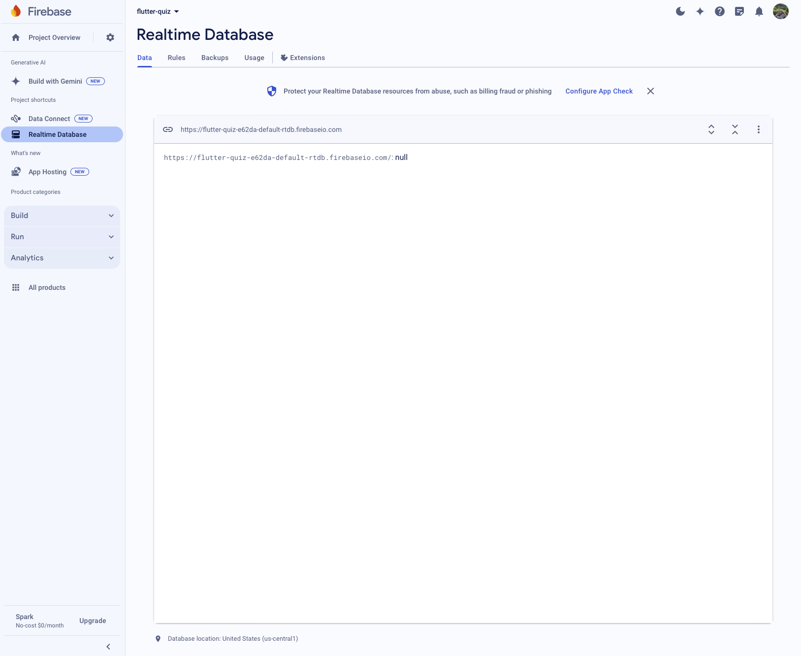
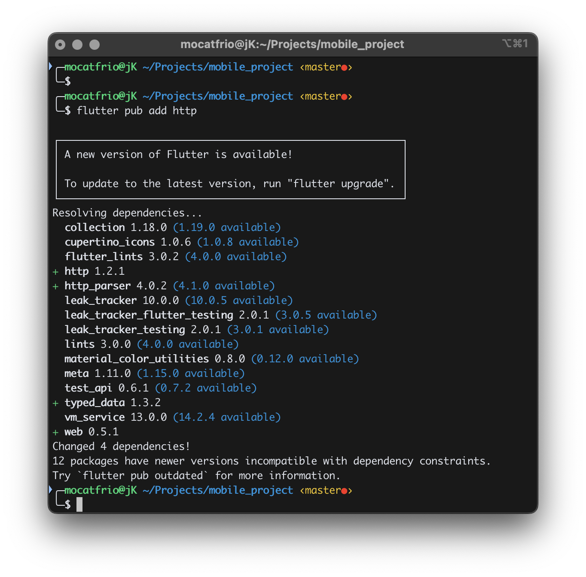
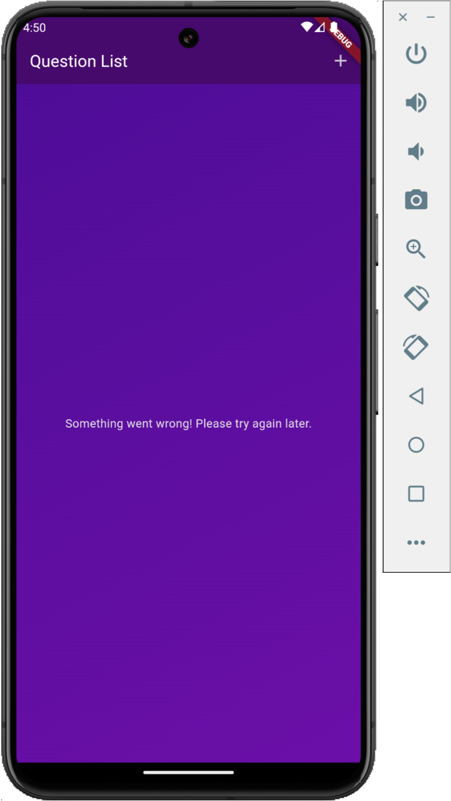

# Module 6: Connecting Backend

Integrating **Firebase** as the backend for a Flutter application.

- [Module 6: Connecting Backend](#module-6-connecting-backend)
  - [1. Preparation](#1-preparation)
    - [a. Run Project](#a-run-project)
    - [b. Setting Up Firebase](#b-setting-up-firebase)
    - [c. Setting Up Flutter HTTP Package](#c-setting-up-flutter-http-package)
  - [2. Sending POST Request to Backend](#2-sending-post-request-to-backend)
    - [a. Create Question Data](#a-create-question-data)
    - [b. Add Loading State](#b-add-loading-state)
  - [2. Handling GET Request from Backend](#2-handling-get-request-from-backend)
    - [a. Load Question Data](#a-load-question-data)
  - [3. Sending DELETE Request to Backend](#3-sending-delete-request-to-backend)
    - [a. Delete Question Data](#a-delete-question-data)
  - [3. Sending DELETE Request to Backend](#3-sending-delete-request-to-backend-1)


## 1. Preparation 
### a. Run Project
1. Launch **Flutter Emulator** in the VS Code. Select **Pixel 8 API 33** (adjust to the android emulator you've created)
   

   
   
2. Run the project
    ```bash
    flutter run
    ```
    The output:
    ```bash
    Flutter run key commands.
    r Hot reload. 🔥🔥🔥
    R Hot restart.
    h List all available interactive commands.
    d Detach (terminate "flutter run" but leave application running).
    c Clear the screen
    q Quit (terminate the application on the device).
    ```
    To restart after making changes in the code:
    ```
    shift + R
    ```

### b. Setting Up Firebase
1. Sign in to Firebase:
    * Go to the [Firebase Console](console.firebase.google.com)
    * Sign in with your Google account
2. Create a New Project:
    * Click "**Create a Project**" 
    * Enter the project name, for example "flutter-quiz". Click "**Continue**"
    * Click "**Continue**"
    * Click "**Create Project**"
3. Set Up Database
    * In the Sidebar > Product categories, Click "**Build**" > "**Realtime Database**"
    * Click "**Create Database**" button
    * Click "**Next**"
    * Select "**Start in test mode**". Click "**Enable**"



### c. Setting Up Flutter HTTP Package

1. Open your terminal
2. Move the directory of your flutter project, for example 
    ```bash
    cd Projects/mobile_project
    ```

3. In the flutter project, add flutter package
    ```bash
    flutter pub add http
    ```

    

4. Read further documentation: https://pub.dev/packages/http

## 2. Sending POST Request to Backend

### a. Create Question Data

**lib/components/question_list_screen/new_question.dart**

1. Import `http` package which provides a convenient way to perform HTTP requests.
    ```dart
    import 'package:http/http.dart' as http;
    ```
   
2. Import `dart:convert` library which provides utilities for converting between different data representations, particularly for encoding and decoding JSON data. 
    ```dart
    import 'dart:convert';
    ```
   
3. Modify the `_saveItem` function into **asynchronous** that does not return a value (void). An `async` function allows us to perform asynchronous operations without blocking the execution of your program. It enables the use of the `await` keyword within the function, which pauses the execution of the function **until the awaited Future completes**. This helps manage asynchronous tasks more conveniently and readably.
    ```dart
    void _saveItem() async {
    ```

4. First, the method checks if the form is valid. If validation passes, the form is saved.
    ```dart
    if (_formKey.currentState!.validate()) {
        _formKey.currentState!.save();
    ```

5. Define a final variable `url` which store URI (Uniform Resource Identifier) for HTTPS (Hypertext Transfer Protocol Secure) requests. The `Uri.https` method takes **two primary arguments**:
    * **Authority**: The domain or hostname of the server. For example: `'flutter-quiz-xxx-default-rtdb.firebaseio.com'`. Look at the Firebase Realtime Database URL provided in the Firebase console.  
    * **Unencoded Path**: The path component of the URI, specifying the endpoint. For example: `'question-list.json'`. The name is up to you.


    ```dart
    final url = Uri.https('flutter-quiz-xxx-default-rtdb.firebaseio.com', 'question-list.json');
    ```

6. Send data to backend using `POST` request. The http.post method is used to send data to the specified URL. The data is encoded in `JSON` format, including the question text, answers, and category.
    ```dart
    final response = await http.post(url,
          headers: {
            'Content-Type': 'application/json',
          },
          body: json.encode({
            'text': _enteredQuestion,
            'answers': [_enteredAnswers],
            'category': categories[_selectedCategory]!.title
          }));
    ```

7. Receive rensponse from backend.
    ```dart
    final Map<String, dynamic> resData = json.decode(response.body);
    ```

8. Ensure that the `widget context` is still "mounted" before performing any navigation. This check avoids errors that could occur if the widget has been removed from the widget tree.
    ```dart
    if (!context.mounted) {
        return;
    }
    ```

9. The last step, navigate back to the previous screen and passes a new Question object created from the data received from the server.
    ```dart
    Navigator.of(context).pop(Question(
        id: resData['name'],
        text: _enteredQuestion,
        answers: [_enteredAnswers],
        category: categories[_selectedCategory]!
    ));
    ```

### b. Add Loading State

1. Define a variable `_isSending` to `false` in the `_NewQuestionState` class.
    ```dart
    class _NewQuestionState extends State<NewQuestion> {
        final _formKey = GlobalKey<FormState>();
        var _enteredQuestion = '';
        var _enteredAnswers = '';
        var _selectedCategory = Categories.mobileProgramming;
        var _isSending = false;
    ```

2. Change `_isSending` state inside the `_saveItem` function. The `setState` function is called to update the UI by setting `_isSending` to true. This can be used to display a loading indicator in the UI.
    ```dart
    // add loading
    setState(() {
        _isSending = true;
    });
    ```

3. Call `_isSending` variable in the onPressed button.  
    ```dart
    Row(
        mainAxisAlignment: MainAxisAlignment.end,
        children: [
            TextButton(
                onPressed: _isSending ? null : () {
                    _formKey.currentState!.reset();
                },
                child: const Text('Reset'),
            ),
            ElevatedButton(
                onPressed: _isSending ? null : _saveItem,
                child: _isSending ? const SizedBox(height: 16, width: 16, child: CircularProgressIndicator(),) : const Text('Add Item'),
            ),
        ],
    )
    ```

    * **TextButton** `onPressed`: The onPressed callback is set to null if `_isSending` is true, making the button **disabled**. If `_isSending` is false, it allows resetting the form by calling `_formKey.currentState!.reset()`.
  
    * **ElevatedButton** `onPressed`: The onPressed callback is set to null if `_isSending` is true, disabling the button. If `_isSending` is false, it allows calling the `_saveItem` function to submit the form.

## 2. Handling GET Request from Backend

### a. Load Question Data

**lib/components/question_list_screen/question_list_screen.dart**

1. Import `http` package which provides a convenient way to perform HTTP requests.
    ```dart
    import 'package:http/http.dart' as http;
    ```
   
2. Import `dart:convert` library which provides utilities for converting between different data representations, particularly for encoding and decoding JSON data. 
    ```dart
    import 'dart:convert';
    ```
   
3. Create a new **asynchronous** function `_loadQuestions` that does not return a value (void). 
    ```dart
    void _loadQuestions() async {
    ```

4. Construct a secure HTTPS URI pointing to the 'question-list.json' endpoint in the Firebase Realtime Database.
    ```dart 
    final url = Uri.https('flutter-quiz-xxx-default-rtdb.firebaseio.com', 'question-list.json');
    ```

5. Send an asynchronous GET request to the specified URL.
    ```dart
    final response = await http.get(url);
    ```

6. Handle error based on the response status code. If the response status code is **400 or higher (indicating an error)**, `_errorText` is updated to display an error message in the UI.
    ```dart
    if (response.statusCode >= 400) {
        setState(() {
            _errorText = "Failed to fetch data. Please try again later :)";
        });
    }
    ```
    The `_errorText` variable is defined above.
    ```dart
    class _QuestionListScreenState extends State<QuestionListScreen> {
        List<Question> _questions = [];
        var _isLoading = true;
        String? _errorText;
        ...
    ```

7. Handle "No Data" case. If the response body is 'null', it means there are no questions available. `_isLoading` is set to false, and the function returns early.
    ```dart
     if (response.body == 'null') {
        setState(() {
            _isLoading = false;
        });
        return;
    }
    ```
    The `_isLoading` variable is defined above.
    ```dart
    class _QuestionListScreenState extends State<QuestionListScreen> {
        List<Question> _questions = [];
        var _isLoading = true;
        String? _errorText;
        ...
    ```

8. Process the response data. First, decode the JSON response body into a `Map<String, dynamic>` named `listQuestion`.
    ```dart
    final Map<String, dynamic> listQuestion = json.decode(response.body);
    ```

    Then, iterate through `listQuestion.entries` to create `Question` objects. 
    * Retrieve the category from `categories` dummy data. 
    * Cast the answers from dynamic to `List<String>`. 
    * Add each constructed Question object to the `loadedQuestion` list.
  
    ```dart
    final List<Question> loadedQuestion = [];
    for (final question in listQuestion.entries) {
        final category = categories.entries
            .firstWhere(
                (catItem) => catItem.value.title == question.value['category'])
            .value;

        final List<String> answers = question.value['answers'].cast<String>();

        loadedQuestion.add(Question(
            id: question.key,
            text: question.value['text'],
            answers: answers,
            category: category)
        );
    }
    ```

9. Update `_questions` with the newly loaded questions (`loadedQuestion` list). Set `_isLoading` to false, indicating that loading is complete.
    ```dart
    setState(() {
        _questions = loadedQuestion;
        _isLoading = false;
    });
    ```

10. Handle exception. If an error occurs during the GET request or processing (`try` block), `_errorText` is updated to display a generic error message.
    ```dart
    catch (error) {
        setState(() {
            _errorText = 'Something went wrong! Please try again later.';
        })
    }
    ```

11. In the UI, call `_isLoading` to display a `CircularProgressIndicator` widget, which provides visual feedback to the user that a loading process is ongoing. 
    ```dart
    // if loading
    if (_isLoading) {
      content = const Center(
        child: CircularProgressIndicator(),
      );
    }
    ```

    Call `_errorText` to display an error text, which provides visual feedback to the user if an error is occured.
    ```dart
     // handling error
    if (_errorText != null) {
      content = Center(
        child: Text(_errorText!),
      );
    }
    ```

    <div style="text-align: center;">
        
    </div>

12. In the beginning of `_QuestionListScreenState` class, override the `initState` method to perform load questions data when the widget is created.
 
    ```dart
    @override
    void initState() {
        super.initState();
        _loadQuestions();
    }
    ```

## 3. Sending DELETE Request to Backend

### a. Delete Question Data

**lib/components/question_list_screen/question_list_screen.dart**

1. Modify the `_removeQuestion` function into **asynchronous** that does not return a value (void). 
    ```dart
    void _removeQuestion(Question question) async {
    ```

2. Find and store the Index of the Question. This is useful for restoring the question to its original position if the deletion fails.
    ```dart
    final index = _questions.indexOf(question);
    ```

3. Remove the question locally. The `question` is removed from the `_questions` list, which will trigger a UI update to reflect the removal.
    ```dart
    setState(() {
        _questions.remove(question);
    });
    ```

4. Constructs a URL pointing to the specific question in the Firebase Realtime Database, using the `question’s id`.
    ```dart
    final url = Uri.https('flutter-quiz-e62da-default-rtdb.firebaseio.com', 'question-list/${question.id}.json');
    ```

5. Send an asynchronous DELETE request to the specified URL to remove the question from the remote database.
    ```dart
    final response = await http.delete(url);
    ```

6. Handle error based on the response status code. 
If the DELETE request failed, the question is **reinserted** into its original position in the local `_questions` list, and `setState` is called to update the UI.

    ```dart
    if (response.statusCode >= 400) {
        setState(() {
            _questions.insert(index, question);
        });
    }
    ```

## 4. Using FutureBuilder

